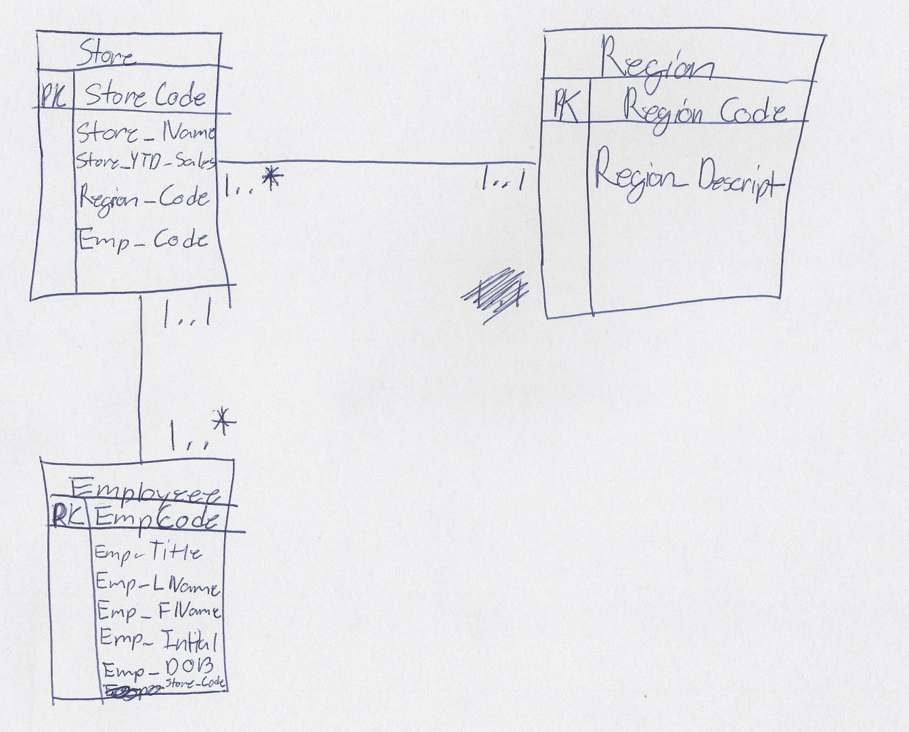

# Homework #2

## by Austin Barrett

### CHAPTER 3

2\. Yes all tables have a valid (i.e. unique) primary key

9\. 

10\. 

| Table    | Primary Key | Foreign Key |
| -------- | ----------- | ----------- |
| EMPLOYEE | EMP_CODE    | JOB_CODE    |
| BENIFIT  | EMP_CODE    | PLAN_CODE   |
| JOB      | JOB_CODE    | NONE        |
| PLAN     | PLAN_CODE   | NONE        |

